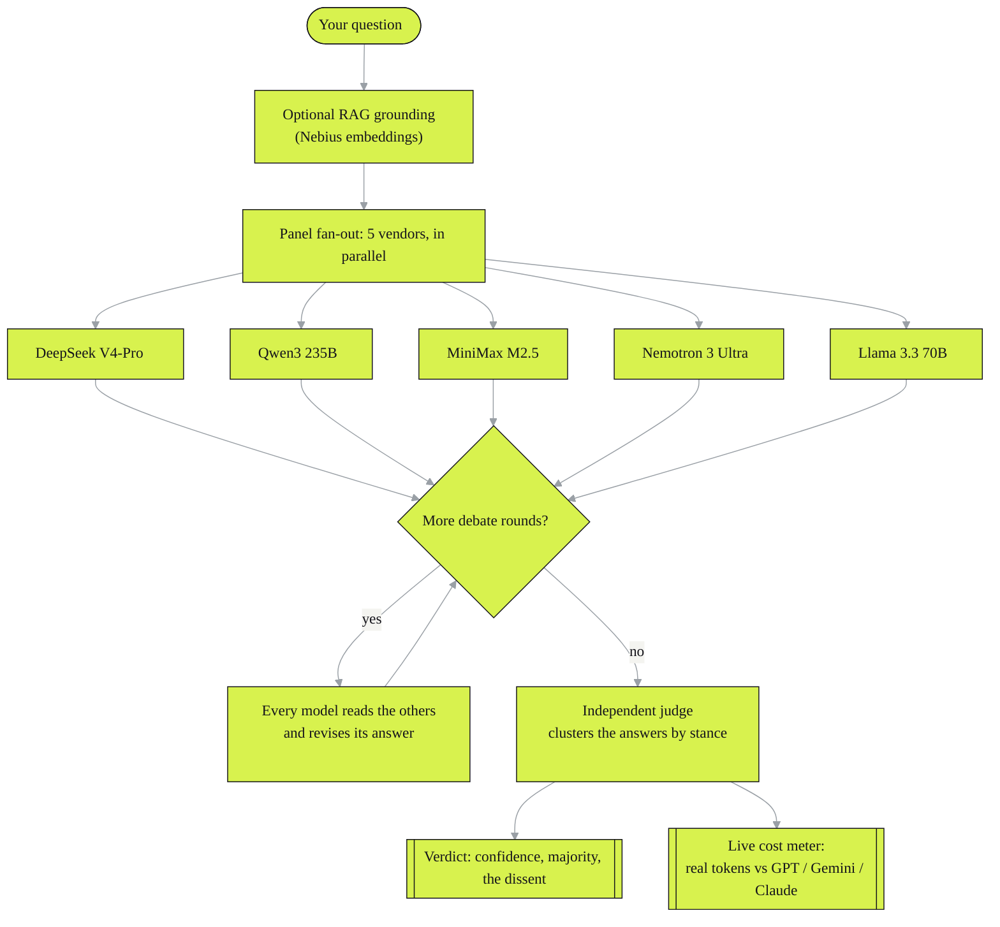
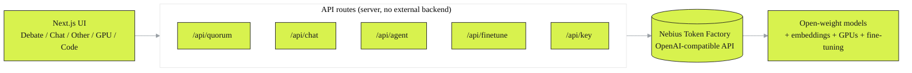

<div align="center">

# Quorum

### Don't ask one AI. Convene a council.

[](LICENSE)
[](https://nextjs.org/)
[](https://react.dev/)
[](https://tokenfactory.nebius.com)
[](#honest-by-design)
[](#)

</div>

Quorum runs a question past five frontier open-weight models *from five different vendors* at once, lets them read each other and debate, then an independent judge clusters their answers and shows you **where they disagree** — the signal a single chatbot quietly hides from you.

Every model, the judge, the embeddings, the fine-tuning, the GPUs — all on **one Nebius Token Factory key, one bill**. No model lock-in. Nothing leaves your machine except the model calls themselves.

---

## Why it exists

A single model gives you one confident answer and buries its own uncertainty. Ask five — DeepSeek, Qwen, Kimi, a Nemotron, a Llama — and the *disagreement* is the interesting part. Quorum makes that disagreement the product:

- **5 vendors, 1 credit pool.** A closed provider physically cannot hand you Meta + Alibaba + DeepSeek + NVIDIA + MiniMax on one invoice. Nebius can. That's the whole pitch.
- **A real cost meter.** Every answer is priced from the *actual* token usage the API returns, times Nebius's published rates, shown live against what GPT-5.5 / Gemini 3.1 Pro / Claude Opus would have cost for the same tokens. A whole 5-model panel usually costs less than a single closed-model call.

## How a debate works



## What's inside

| Mode | What it does |
|---|---|
| **Debate** | The 5-model council answers, optionally runs *N* debate rounds (each model reads the others and revises), then a judge returns a clustered verdict — confidence, the majority stance, and the dissent. |
| **Chat** | One-on-one with the top model from every provider. Full conversation memory, markdown, copy, stop. |
| **Other** | Every model your key can actually call, grouped by category — **Text**, **Vision** (attach or paste an image), **Embedding** (full vector, copyable). |
| **GPU** | Every Nebius GPU with live per-hour prices, a cost calculator, the exact steps to rent a dedicated endpoint, and **fine-tuning** — upload examples, train a model, and it drops straight into your Chat picker. |
| **Code** | An agentic coding agent over a local folder: it reads, edits, and (if you allow) runs commands — powered by whichever open model you pick. |

## Architecture



## Run it

You need a [Nebius Token Factory](https://tokenfactory.nebius.com) API key.

```bash
git clone https://github.com/TheClazer/quorum.git
cd quorum
npm install
npm run build
npm run start      # http://localhost:3000
```

On Windows, double-click **`Quorum.bat`** instead — it finds a free port, installs and builds on first run, verifies it's actually Quorum (not some other app on 3000), and opens your browser to the right URL.

**First launch asks for your Nebius key**, validates it against the API, and stores it locally (gitignored — never committed, never sent to the browser). Replace or remove it any time from **Settings**. Prefer an env var? Put `NEBIUS_API_KEY=...` in `.env.local` and it takes precedence.

## Honest by design

- Token counts come straight from each call's `usage` field; costs are real tokens times Nebius's published rates. Nothing is fabricated.
- The model catalog is what the key can *actually* call — it self-checks against `/v1/models`, so a model Nebius removes gets dropped instead of silently failing. The judge is independent of the panel and self-heals to a backup if it ever goes away.
- Image **generation** and **video** aren't deployed on the standard serverless key (the app verifies this live and tells you); image **understanding** works on the vision models.
- Hit **Stop** and the in-flight model calls are actually cancelled server-side — you stop paying immediately.

## Stack

Next.js 15 (App Router) · React 19 · the `openai` SDK pointed at Nebius's OpenAI-compatible endpoint · no backend service, no telemetry, no database.

## License

[MIT](LICENSE) © 2026 Rayyan Shaikh. Built on [Nebius Token Factory](https://tokenfactory.nebius.com).
